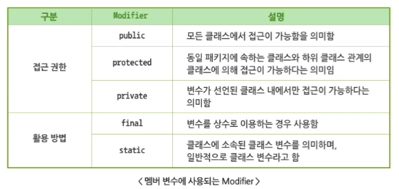
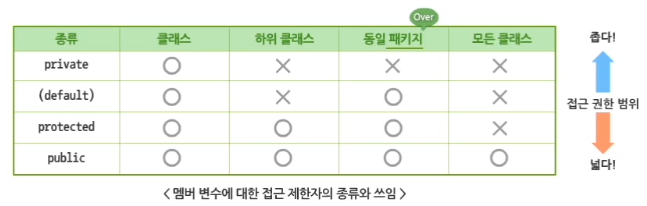

# 클래스의 구조와 객체 생성

#TIL/java

---

## 클래스의 구조

- 객체의 초기화를 담당하는 생성자(Constructor)
- 클래스가 가지는 속성을 정의하는 멤버 변수(Variable)
- 클래스가 가지는 데이터를 조작하고 변환하는 메서드(Method)


### 클래스 Modifier(제어자)

- 접근 권한 예약어
  - public, protected, private, (default)
- 활용 방법 예약어
  - final, abstract, static, ...

---

## 객체 생성

### 자바의 변수

- 기본형 변수
- 참조형 변수


### 객체 생성 순서

1. 특정 클래스 유형의 객체 참조 변수 선언

   ```java
   Car Yellow;
   ```

2. 객체 생성 단계 - 객체가 사용할 메모리 영역을 할당

   ```java
   Yellow = new Car();
   ```


### 멤버 변수의 선언

- 전역(Global) 변수
  - 클래스 선언부 밑에 선언된 변수로 멤버 변수라고 부른다.
  - 여러 메서드에서 공통으로 사용 가능
    - 객체가 가질 수 있는 속성을 나타낼 때 사용
- 지역(Local) 변수
  - 메서드 선언부 밑에 선언된 변수
  - 해당 변수가 선언된 메서드 내에서만 사용 가능




### 접근 제한자(Access Modifier)

- 클래스, 변수, 메서드에 접근할 수 있는 권한을 나타내기 위해 사용된다.




접근 제한자를 통해 정보 은닉(Information Hiding)을 구현할 수 있게 된다.

---

## 멤버 메서드

- 메서드는 일종의 함수(Function)로서, 클래스가 제공할 로직들을 정의한다.
- 메서드를 활용하여 코드를 간결하게 만들 수 있으며 코드의 재사용성이 높아진다.

 

### 정보 은닉

- 멤버 변수들은 대부분의 경우 private으로 선언하여 외부에서는 숨겨진 형태로 만든다.
- public으로 지정한 메서드를 통해 접근하도록 클래스를 구현한다. (Getter, Setter 메서드)
