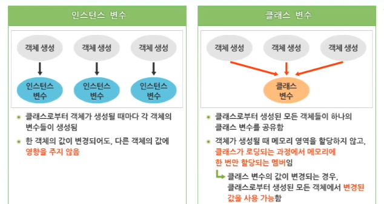

# 자바 Modifier와 생성자

#TIL/java

---

## 자바의 Modifier

### static

- 멤버 변수와 메서드 앞에 붙일 수 있는 modifier, 활용 방법을 제어한다.
  - static 예약어가 붙지 않는 `인스턴스 변수`
    - 생성된 인스턴스마다 그 안에 클래스의 인스턴스 변수들이 포함된다.
    - 일반적인 멤버 변수를 인스턴스 변수라고 부른다.
  - static 예약어가 붙는 `클래스 변수`
    - 클래스로부터 생성된 인스턴스에 포함되지 않는 변수
    - 많은 인스턴스들을 생성하더라도 메모리에 하나의 변수만 존재한다.
    - 객체를 생성하지 않고도 접근 가능


### 클래스 변수가 필요한 이유는 무엇일까?

직원들의 이름, 사번, 나이, 회사명 등의 데이터를 가지고 있는 클래스가 있다.

각각의 데이터에서 이름, 사번, 나이 등의 정보는 다른 값을 가지겠지만 회사명은 S전자로 동일하다고 할 때 동일한 값을 가지는 회사명과 같은 변수를 인스턴스 변수로 선언한다면 메모리를 불필요하게 사용하게 될 것이다.




### 클래스 변수의 접근

클래스 변수는 일반적으로 객체 참조 변수 이름이 아닌 클래스 이름을 통해서 접근한다. (객체를 생성하지 않고도 클래스 변수에 접근 가능)

---

### final

- final이 붙은 변수는 단 한 번 초기화가 가능하지만, 초기화 이후에는 값을 변경할 수 없는 상수이다.
- 부모 클래스에서 final 예약어를 사용함으로써 자식 클래스에서의 메서드 오버라이딩을 금지시킬 수 있다.


overriding

- 상속 구조에서 부모 클래스의 메서드와 동일한 모양의 메서드를 자식 클래스에서 상속 받지 않고 재정의하는 것을 말한다.


클래스와 final

- 클래스를 선언할 때 클래스 앞에 final 예약어를 추가하면 상속을 금지한다는 의미이다. (자식 클래스를 가지지 못한다)

---

### abstract

- 클래스와 메서드를 선언할 때 사용
  - 클래스 선언부에서 사용 시 추상 클래스 선언
  - 메서드를 선언할 때 사용 시 추상 메서드 정의


추상 메서드

- 메서드의 시그니처(리턴 타입, 메서드명, 매개변수)만 정의되고 구체적인 행위, 즉 블록 부분은 정의되지 않은 메서드

```java
abstract int sum(int num1, int num2);
```


추상 클래스

- 추상 메서드를 포함하고 있는 클래스


### 자바는 아무런 기능을 갖지 못하는 추상 메서드와 추상 클래스를 왜 지원하는 것일까?

추상 클래스와 `상속`이 결합되어야 정확하게 추상 클래스를 이해할 수 있다.

추상 클래스를 상속 받은 자식 클래스에서 메서드를 오버라이딩한다.


### 정리

static

- 멤버 변수 앞에 붙이면 멤버 변수를 클래스 변수로 선언하는 것이며, 클래스로부터 생성되는 모든 객체들이 공유하는 변수가 된다.

final

- 변수 앞에 붙이면 상수를 의미하고, 메서드 앞에 붙이면 Overriding을 금지하며, 클래스 앞에 붙이면 상속을 금지시킨다.

abstract

- 클래스와 메서드 앞에 붙일 수 있으며, 메서드 앞에 붙이면 추상 메서드를 의미하고, 클래스 앞에 붙이면 추상 클래스를 의미한다.

---

## 생성자

- 생성자(Constructor)는 클래스로부터 객체를 생성할 때 호출되며, 객체의 멤버 변수 초기화에 사용된다.


### 생성자의 특징

- 생성자는 클래스와 같은 이름을 가진 특별한 메서드로서 객체 생성 시 멤버 변수의 초기화를 담당한다.
- 일반 멤버 메서드와 달리 반환형이 없다. / void도 허용되지 않는다.
- 이름은 같더라도 매개변수를 달리하여 여러 개를 중복정의(Overloading)할 수 있다.


### 기본 생성자

- 클래스에 생성자가 하나도 정의되지 않은 경우, 컴파일러에 의해 자동으로 생성되는 생성자
  - 클래스 내 생성자가 하나라도 정의되어 있으면 기본 생성자는 자동으로 생성되지 않는다.
- 매개변수가 없는 생성자


### this

생성자나 메서드의 매개변수 이름이 객체 변수의 이름과 같다면?

- 객체 변수 이름 앞에 this를 사용해서 구별한다.

```java
public class Employee {
  	String name;
  	int number;
  
  	public Employee(String name, int age){
    		this.name = name;
    		this.age = age;
  	}
}
```

