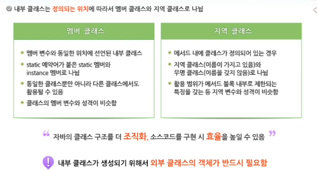
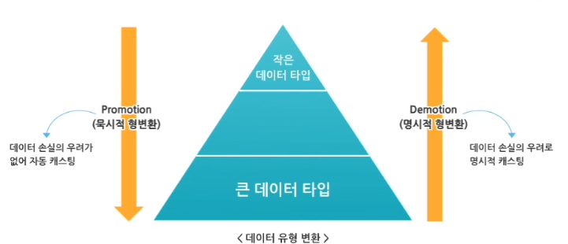

# 추상 클래스와 객체의 형변환

#TIL/java

---

## abstract 예약어

메서드 선언 시, abstract를 붙이면 현재 메서드를 추상 메서드로 정의하겠다는 의미를 가진다.


### 추상 메서드란?

메서드의 시그니쳐(리턴타입, 메서드명, 매개변수)만 정의되고 구체적인 행위, 즉 블록({}) 부분은 정의되지 않은 특수한 메서드

- 메서드의 시그니쳐가 선언되어 있으므로 기본적인 기능 유추는 가능하다.


### 객체지향 프로그램에서 추상 메서드가 필요한 이유는?

상속을 통해 의미를 가지는 추상 메서드


### 추상 클래스

추상 클래스는 일반적으로 하나 이상의 추상 메서드를 포함 (추상 메서드가 없더라도 추상 클래스로 선언 가능)

- 추상 클래스는 객체 생성이 불가능


### 자바는 왜 추상 클래스를 지원할까?

추상 클래스를 상속한 자식 클래스는 부모 클래스가 가지고 있는 모든 추상 메서드를 Overriding 해야만 객체를 생성할 수 있다.

> 추상 클래스를 사용해야 유지보수의 편의성을 높일 수 있다.

---

## 내부 클래스

클래스는 데이터를 표현하기 위한 하나의 기본 단위로서 멤버 변수와 메서드로 구성되어 있다.

어떠한 경우에는 클래스가 다른 클래스를 포함하기도 하는데, 이렇게 내부에 포함되는 클래스를 내부 클래스라고 한다.

- 파일 크기의 최소화, 보안, 성능 향상, 이벤트 처리 등을 쉽게 하기 위하여 사용된다.




---

## 객체의 형변환

 


### 묵시적 형변환

형변환 연산자를 사용하지 않아도 자동으로 이루어지는 경우 (자동 형변환)


### 명시적 형변환

더 작은 범위를 나타내는 데이터 타입으로 변환되는 경우 (축소 형변환)


### 자바에서 객체 참조변수의 형변환

```java
leftObjRef = rightObjRef
```

- 왼쪽 항과 오른쪽 항의 객체 유형이 서로 다른 경우 두 유형은 서로 상속 관계에 있다.
- 왼쪽 객체가 오른쪽 객체의 상위 클래스인 경우에만 묵시적 형변환이 일어난다.
- 자식 클래스에서 부모 클래스 유형으로 할당하는 것은 가능하지만, 반대의 경우에는 명시적 형변환이 필요하다.


<u>부모 클래스 유형을 자식 클래스 유형으로 강제 형변환하는 경우는?</u>

- 할당되는 인스턴스 유형에 따라 실행 오류 발생

- instanceof 연산자를 사용하여 변환 여부를 확인
  - 생성된 객체가 class와 관계있는 type으로 만들어졌는지 확인
  - true 또는 false를 반환


 ```java
 class Parent{
 	int num = 10;
 	
 	void printNum() {
 		System.out.println(num);
 	}
 }
 
 class Child extends Parent {
 	int num = 20;
 	
 	void printNum() {
 		System.out.println(num);
 	}
 }
 
 public class ObjectCastTest {
 	public static void main(String args[]){
 		Parent p = new Child();
 		p.printNum();
 		System.out.println(p.num);
 	}
 }
 
 // 실행결과
 // 20 - 변수에 대한 접근은 객체의 유형에 의해 결정됨
 // 10 - 메서드 호출은 할당되는 인스턴스에 의해 결정됨
 ```

객체 참조 변수가 변수나 메서드를 참조하는 경우, 참조 관계를 결정하는 시간이 다르기 때문에 나타나는 차이이다.