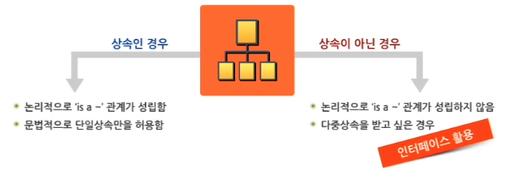
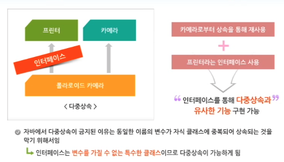

# 인터페이스와 패키지

#TIL/java

---

## 인터페이스

인터페이스에 앞서서 추상 클래스에 대해 잠시 이야기해보자.

추상 클래스는 추상 메서드를 포함하고 있기 때문에 객체 생성이 불가능하고 추상 클래스를 상속한 자식 클래스에서 메서드 오버라이딩을 통해 추상 메서드를 구현한 후 객체를 생성하는 방식으로 사용하였다.

인터페이스는 이러한 추상 클래스보다 추상성이 더욱 심화된 개념이라고 할 수 있다.

인터페이스는 상수와 추상 메서드 외에 다른 멤버를 갖지 못하게 함으로써 추상 클래스보다 더욱 완벽한 추상화를 제공한다.


### 인터페이스를 사용하는 이유는?






```java
public interface 인터페이스명 [extends 부모인터페이스명, ...] {
	// 상수
  	// final 예약어를 이용해서 멤버 변수를 선언해야 함
  	// 인터페이스는 객체를 생성할 수 없으므로, 상수는 static 예약어를 붙여서 선언해야 함
  // 추상 메서드
}
```

> 인터페이스의 변수 선언에 사용된 static final이나 메서드 선언에 사용된 abstract는 생략 가능


## 인터페이스의 활용

1. 인터페이스 상속
2. 자식 클래스 생성
3. 자식 클래스의 객체 생성
4. 프로그램 사용


인터페이스를 상속하는 클래스는 인터페이스에 정의된 추상 메서드들을 Overriding 해야 한다.


### 형변환

인터페이스 사용 시 클래스와 동일하게 묵시적 형변환과 명시적 형변환이 가능하다.


```java
class Circle extends Shape implements Drawable {}

Shape s = new Circle();
Drawable d = new Circle();
```

- 인터페이스는 부모 클래스와 동일한 지위를 가진다.
- 인터페이스 유형의 객체 참조 변수는 인터페이스에 선언된 요소에만 접근 가능하다.


### 인터페이스의 상속

```java
public interface 인터페이스명 [extends 부모인터페이스1, 부모인터페이스2]{
  
}
```

- 인터페이스 상속 시에도 extends 예약어를 사용한다.
- 인터페이스도 상속 관계에 따라 계층 구조를 가질 수 있다.

- 클래스는 다중 상속이 불가능 했던 반면 인터페이스는 여러 개의 인터페이스를 상속 받을 수 있다.

---

## 자바 패키지

패키지는 자바의 클래스들을 분류하고, 관련된 클래스와 인터페이스를 하나의 폴더에 적절하게 배치할 때 관련 클래스들을 묶는 폴더 역할을 한다.

- 다른 기능을 구현한, 같은 이름의 클래스 사용 시 이름의 충돌을 피할 수 있다.
- 관리가 용이하며, 클래스의 접근 권한을 패키지 단위로 제어할 수 있다.


### import 예약어

자바 API에서 제공되는 패키지화된 클래스들을 사용하기 위해서는 import를 해주어야 한다.


### 사용자 정의 패키지

개발자가 작성한 클래스를 특정 패키지로 묶을 수 있다.

package 상위패키지명.패키지명; (패키지 선언 문장은 반드시 첫 번째 문장이어야 함)

or

package 패키지명; (이 파일 내의 모든 클래스는 이 패키지에 포함되어 저장됨)


### 커스텀 라이브러리 생성하기

자바는 프로그램 구현에 필요한 중요 클래스들을 API 형태로 JVM에 포함 시켜두었다.

API에서 제공하지 않거나, API를 응용해서 개발자가 직접 만든 클래스들을 라이브러리 형태로 만들어서 사용하는 것 또한 가능하다.

잘 만들어진 커스텀 라이브러리를 활용하면 비슷한 기능들을 간단하게 구현할 수 있으며, 다른 어플리케이션에서 재사용도 가능해진다.