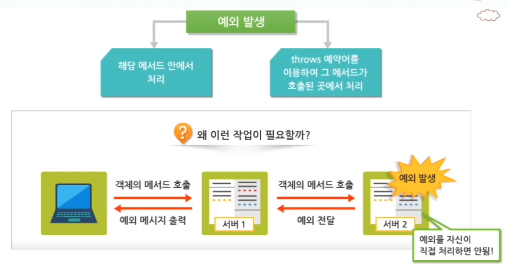

# 예외처리

#TIL/java

---

### 자바에서 예외가 발생하는 경우 예시

- 정수를 0으로 나누는 경우
- 배열의 인덱스가 음수 값을 가지는 경우
- 배열의 인덱스가 배열의 길이를 넘어서는 경우
- 부적절한 형변환이 발생하는 경우
- 입출력시 interrupt가 발생하는 경우
- 입출력을 위한 파일이 존재하지 않는 경우


자바는 객체지향 언어이므로 예외도 객체로 처리한다.

발생 가능성이 있는 모든 예외 상황을 미리 예측하여 다양한 예외 클래스를 제공하고 있다.


### 예외 처리

자바의 예외 처리 방법에는 2가지가 있다.

- 예외가 발생한 메서드 내에서 직접 처리하는 방식
  - try-catch 구문
  - 다중 catch 블록
  - 상속을 이용한 예외 처리
  - finally 블록
- 해당 메서드를 호출한 곳으로 예외 처리를 넘기는 방식
  - throws 예약어


### try-catch 구문

```java
try {
  예외 발생 가능이 있는 소스코드;
} catch(예외 타입 매개변수명) {
	예외 타입의 예외가 발생할 경우 수행될 소스코드;
}
```


프로그램 중에서 예외가 발생할 수 있는 소스코드들을 try 블록 안에 작성한다. try 블록은 최소한 하나의 catch 블록이 있어야 한다.

catch 블록은 try 블록 다음에 위치한다. catch 블록의 매개변수는 예외 객체가 발생했을 때 참조하는 변수명으로, 반드시 java.lang.Throwable 클래스의 하위 클래스 타입으로 선언되어야 한다.


1. 지정한 타입의 예외 객체 발생
2. try 블록의 나머지 문장들은 수행되지 않음
3. 자바 가상 머신(JVM)은 발생한 예외 객체를 발생시킴
4. 발생한 예외 객체 타입에 해당하는 catch 블록을 수행


### 다중 catch 블록

프로그램에서 발생하는 예외에 따라 적절하게 예외 처리를 분기시켜야 한다. 다중 catch 블록을 사용하면 여러 개의 예외를 처리할 수 있다.


### 상속을 이용한 예외 처리

자바에서 지원하는 모든 예외 클래스는 Exception 클래스의 자식 클래스로 존재한다.

이를 활용하면 모든 예외를 Exception 타입의 매개변수를 활용하여 하나의 catch 블록으로 처리할 수 있다.

- 오로지 Exception 타입의 catch 블록으로 예외처리를 한다면 구체적으로 어떤 예외가 발생했는지를 알 수 없고 예외 처리 로직을 분기 처리할 수 없게 된다는 문제점이 있다.

따라서 다중 catch 블록의 마지막 예외 처리로 사용하는 것이 바람직하다.


### finally 블록

finally 블록은 try-catch 블록 지정 시 try 블록과 함께 사용될 수 있다. (필수 사용은 아니다.)

fianlly 블록이 사용되면 finally 블록의 내용은 예외 발생 유무나 예외 catch 유무와 상관 없이 무조건 수행된다.

따라서 데이터베이스 연동 로직, 파일 입출력 로직을 수행한 후에 반드시 수행되어야 할 로직이 있는 경우에 사용한다.

```java
try {
  예외 발생 가능이 있는 소스코드;
} catch(예외 타입 매개변수명) {
	예외 타입의 예외가 발생할 경우 수행될 소스코드;
} finally {
  예외 발생 여부와 무관하게 무조건 수행될 코드;
}
```


### throws 예약어

예외가 발생한 메서드를 호출한 지점으로 예외를 전달하여 처리하는 방법이다.



---


