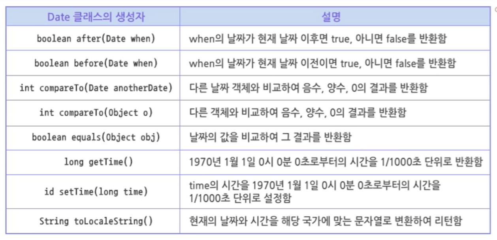

# 01. java.util 개요 및 Utility 클래스

#TIL/java/자바의정석

---

## java.util 패키지

자바 프로그램을 개발할 때 유용한 기능들을 모아놓은 패키지

 

### Date 클래스

형식이 있는 날짜와 시간을 출력하는 클래스

 

 

### Calendar 클래스

Date 클래스처럼 날짜와 시간에 관한 정보를 출력할 때 사용

추상 클래스이므로 직접 객체 생성은 불가능 / getInstance() 메서드를 이용하여 객체 생성 가능

